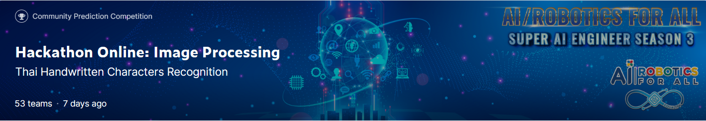
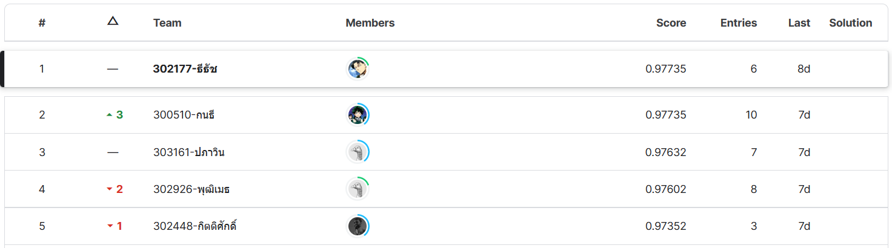

# superai3-Thai_Handwritten_Characters_Recognition
Hackathon Online: Image Processing Thai Handwritten Characters Recognition
Thai Handwritten Characters Recognition is a part of the Super AI Engineer Season 3 Online Hackathon. The objective of this hackathon is to solve an image classification problem related to thai hand writing that have 67 classes.
 

My solution for the Thai Handwritten Characters Recognition Hackathon uses the state-of-the-art model EVA02, as well as test time augmentation, pesudo labeling and augmentation techniques on the training dataset. I am proud to say that my notebook achieved 1st place out of 53 participating teams.
 

LB score 0.97676 #1
PB score 0.97735 #1
 

